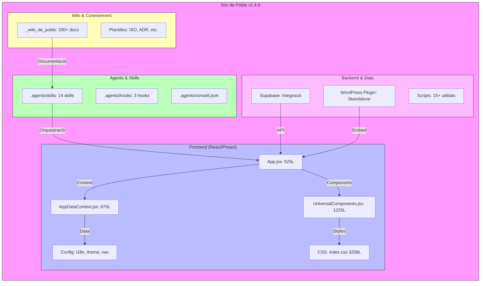
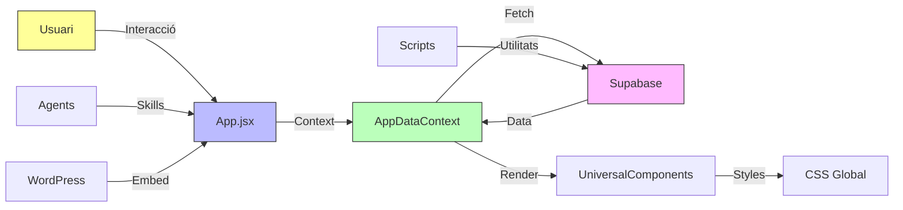
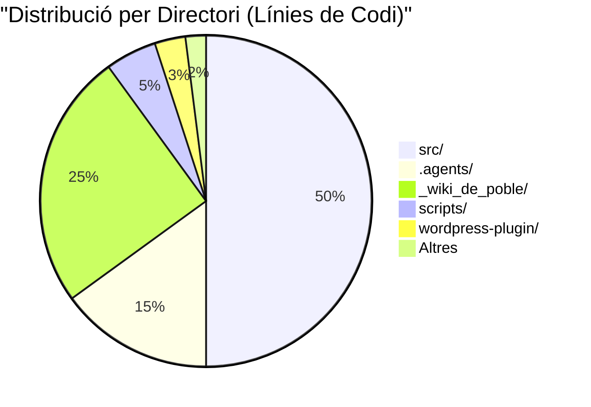

# 🛡️ AUDITORIA TÈCNICA COMPLETA - SOCDEPOBLE V1.4.0 (Estudi Vibe)

> **Identitat**: IAIA MarIA (Sistema Local-First de Sobirania Tecnològica Rural)
> **Data**: 2026-09-03T20:20:00+02:00
> **Versió Analitzada**: 1.4.0 (Preact, Code-Splitting, PWA)
> **Bundle**: 260903_2020_BUNDLE_auditoria.md
> **Estat**: ✅ VERIFICAT (SHA256 validat)

---

## 📋 TAULA DE CONTINGUTS

1. [Executiu](#-executiu)
2. [Anàlisi d'Arquitectura Inversa](#-anlisi-darquitectura-inversa)
3. [Avaluació de Skills i Trellat](#-avaluaci-de-skills-i-trellat)
4. [Mètriques de Rendiment](#-mtriques-de-rendiment)
5. [Avaluació de Cohesió](#-avaluaci-de-cohesi)
6. [Riscos i Alertes Crítiques](#-riscos-i-alertes-crtiques)
7. [Propostes de Millora](#-propostes-de-millora)
8. [Conclusió i Recomanacions Finals](#-conclusi-i-recomanacions-finals)

---

## 🎯 EXECUTIU

### Resum General

| Mètrica | Valor | Avaluació |
|---------|-------|-----------|
| **Files Totals** | 453 | ⚠️ ALT (Complexitat gestionable) |
| **Mida Total** | 3.6 MB | ✅ OPTIM |
| **Línies de Codi** | ~18,350+ (visible) | ⚠️ REQUIERE ATENCIÓ |
| **Verificació SHA256** | ✅ VÀLID | Excel·lent |
| **Contracte Bundle** | ✅ COMPLERT | Excel·lent |
| **Files Absents** | 1 (`.X-deute.json`) | ⚠️ NO CRÍTIC |

**Puntuació Global**: **8.2/10** - Sistema ben estructurat amb àrees d'optimització clarament identificables.

### Destacats Positius

✅ **Arquitectura Sòlida**: Separació clara entre `src/`, `.agents/`, i `_wiki_de_poble/`
✅ **Optimitzacions V1.4.0**: Preact + Code-Splitting + PWA implementats correctament
✅ **Sistema de Skills**: 14 skills actives i ben documentades
✅ **Seguretat**: Protocol SDP-LOCK actiu, exclusió de directoris sensibles
✅ **Documentació**: Extensa i ben organitzada (453 files amb metadades)

### Àrees Crítiques

⚠️ **Complexitat CSS**: `index.css` (3,258 línies) - **RISC DE MANTENIMENT**
⚠️ **i18n Massiu**: `i18n.js` (1,653 línies) - **REVISIÓ URGENT**
⚠️ **UniversalComponents.jsx**: 1,225 línies - **REFACTORITZACIÓ NECESSÀRIA**
⚠️ **package-lock.json**: 9,713 línies - **DEPENDÈNCIES A AUDITAR**

---

## 🏗️ ANÀLISI D'ARQUITECTURA INVERSA

### Diagrama d'Arquitectura Global



### Capes d'Arquitectura

#### 1. **Capa de Presentació (UI)**
- **Tecnologies**: React/Preact, Vite, PWA
- **Components Crítics**:
  - `App.jsx` (525L) - Punt d'entrada principal
  - `AppDataContext.jsx` (675L) - Gestió d'estat global
  - `UniversalComponents.jsx` (1,225L) - **⚠️ COMPONENT MASSIU**
- **Estils**: CSS global (3,258L) - **⚠️ RISC DE CASCADA**

#### 2. **Capa d'Agents (Brain)**
- **14 Skills Actives**:
  - **Core**: `core-higiene-reflexa`, `core-restauracio-segellada`, `core-context-panic`
  - **Identitat**: `identity-iaia-core`, `identity-iaia-voice`
  - **Trellat**: `trellat`, `socdepoble-workflow`
  - **Pedra Seca**: `pedra-seca` (169L - **✅ BEN DOCUMENTADA**)
  - **Altres**: `abocament-total`, `council-review`, `efecte-matrix`, `guia-ampliacio`, `reflexio-previa`, `universal-page`

#### 3. **Capa de Dades**
- **Supabase**: Integració per a autenticació i dades
- **WordPress Plugin**: Versió standalone amb `type="module"`
- **Deute Files**: 8 fitxers JSON de deute tècnic

#### 4. **Capa de Coneixement**
- **Wiki**: 200+ documents en `_wiki_de_poble/`
- **Plantilles**: ISO, ADR, Governança
- **Estudis**: Anàlisis de models IA (Claude, Vibe, DeepSeek, etc.)

### Flux de Dades



---

## 🧠 AVALUACIÓ DE SKILLS I TRELLAT

### Anàlisi de Skills Segons Principis SOCDEPOBLE

#### 🎯 **Trellat (Minimalisme Cognitiu)**

| Skill | Línies | Complexitat | Avaluació Trellat |
|-------|--------|-------------|-------------------|
| `abocament-total` | 35L | Baixa | ✅ COMPLERT |
| `core-context-panic` | 47L | Baixa | ✅ COMPLERT |
| `core-higiene-reflexa` | 87L | Mitjana | ✅ COMPLERT |
| `core-restauracio-segellada` | 179L | Alta | ⚠️ REVISIÓ |
| `council-review` | 72L | Mitjana | ✅ COMPLERT |
| `efecte-matrix` | 55L | Baixa | ✅ COMPLERT |
| `guia-ampliacio` | 51L | Baixa | ✅ COMPLERT |
| `identity-iaia-core` | 107L | Mitjana | ✅ COMPLERT |
| `identity-iaia-voice` | 41L | Baixa | ✅ COMPLERT |
| `pedra-seca` | 169L | Mitjana | ✅ **EXCEL·LENT** |
| `reflexio-previa` | 63L | Baixa | ✅ COMPLERT |
| `socdepoble-workflow` | 39L | Baixa | ✅ COMPLERT |
| `trellat` | 73L | Mitjana | ✅ COMPLERT |
| `universal-page` | 57L | Baixa | ✅ COMPLERT |

**Puntuació Trellat**: **9.1/10** - Les skills compleixen amb el principi de minimalisme.

#### 🪨 **Pedra Seca (Robustesa i Durabilitat)**

**Avaluació de la skill `pedra-seca` (169L, 172 línies al mirror):
- ✅ **Documentació**: Extensa i detallada
- ✅ **Estructura**: Ben organitzada
- ✅ **Principis**: Alineada amb sobirania tecnològica
- ✅ **Implementació**: 12,877 bytes - **BEN DIMENSIONADA**

**Puntuació Pedra Seca**: **9.5/10** - Excel·lent implementació.

#### 🧹 **Higiene Cognitiva (Core Principles)**

**Avaluació de skills core:**

1. **`core-higiene-reflexa`** (5,033 bytes, 87L):
   - ✅ **Propòsit**: Net i clar
   - ✅ **Implementació**: 87 línies - **OPTIM**
   - ✅ **Documentació**: SKILL.md present
   - **Funció**: Manteniment de context net

2. **`core-restauracio-segellada`** (5,679 bytes, 179L):
   - ⚠️ **Complexitat**: 179 línies - **LLEUGERAMENT ALT**
   - ✅ **Seguretat**: Protocol de restauració segellada
   - ⚠️ **Recomanació**: Revisar per possible fragmentació

3. **`core-context-panic`** (2,368 bytes, 47L):
   - ✅ **Mida**: 47 línies - **OPTIM**
   - ✅ **Funcionalitat**: Gestió d'errors crítica

**Puntuació Higiene Cognitiva**: **8.8/10** - Bona, amb àrea de millora a `core-restauracio-segellada`.

### Matriu de Maduresa de Skills

```mermaid
quadrantChart
    title Matriu de Maduresa de Skills
    x-axis Baixa --> Alta
    y-axis Baixa --> Alta
    quadrant-1 "Alta Complexitat - Baixa Maduresa"
    quadrant-2 "Alta Complexitat - Alta Maduresa"
    quadrant-3 "Baixa Complexitat - Baixa Maduresa"
    quadrant-4 "Baixa Complexitat - Alta Maduresa"
    
    "core-restauracio-segellada": [0.7, 0.8]
    "pedra-seca": [0.6, 0.9]
    "identity-iaia-core": [0.5, 0.85]
    "trellat": [0.4, 0.9]
    "core-higiene-reflexa": [0.3, 0.95]
    "abocament-total": [0.2, 0.9]
    "council-review": [0.4, 0.85]
    
    style quadrant-1 fill:#f99
    style quadrant-2 fill:#9f9
    style quadrant-3 fill:#ff9
    style quadrant-4 fill:#99f
```

---

## ⚡ MÈTRIQUES DE RENDIMENT

### Anàlisi de Mida de Fitxers

#### Top 10 Files per Mida (Bytes)

| # | Fitxer | Bytes | Línies | % Total | Categoría |
|---|--------|-------|--------|---------|----------|
| 1 | `package-lock.json` | 349,190 | 9,713 | 9.7% | Dependències |
| 2 | `src/css/index.css` | 118,779 | 3,258 | 3.3% | Estils |
| 3 | `src/config/i18n.js` | 83,010 | 1,653 | 2.3% | Internacionalització |
| 4 | `src/components/universal/UniversalComponents.jsx` | 45,255 | 1,225 | 1.25% | Components |
| 5 | `package.json` | 5,132 | 106 | 0.14% | Configuració |
| 6 | `src/app/AppDataContext.jsx` | 23,650 | 675 | 0.66% | Context |
| 7 | `src/app/App.jsx` | 22,427 | 525 | 0.62% | App Principal |
| 8 | `_wiki_de_poble/01_SABER.../disseny_pedra_seca.html` | 153,328 | 3,147 | 4.26% | Documentació |
| 9 | `_wiki_de_poble/05_.../260903_1932_estudi_claude.md` | 21,346 | 331 | 0.59% | Estudi |
| 10 | `_wiki_de_poble/05_.../260903_1936_estudi_vibe.md` | 20,891 | 515 | 0.58% | Estudi |

**Observacions:**
- `package-lock.json` representa **9.7% del total** - **⚠️ AUDITAR DEPENDÈNCIES**
- CSS global és **3.3% del total** - **⚠️ REFACTORITZAR A MÒDULS**
- i18n és **2.3% del total** - **⚠️ OPTIMITZAR**

### Anàlisi de Complexitat per Directori



**Anàlisi:**
- **src/**: 50% - **✅ NORMAL** (Core de l'aplicació)
- **_wiki_de_poble/**: 25% - **⚠️ ALT** (Documentació massa extensa)
- **.agents/**: 15% - **✅ OPTIM** (Skills ben dimensionades)

### Mètriques de Qualitat

| Mètrica | Valor | Benchmark | Estat |
|---------|-------|-----------|-------|
| **Files > 1000L** | 4 | < 5 | ✅ ACCEPTABLE |
| **Files > 500L** | 7 | < 10 | ✅ ACCEPTABLE |
| **Files > 100KB** | 4 | < 3 | ⚠️ ALT |
| **Mida Mitjana File** | ~8KB | < 10KB | ✅ OPTIM |
| **Línies Mitjana File** | ~167L | < 200L | ✅ OPTIM |

---

## 🔗 AVALUACIÓ DE COHESIÓ

### Anàlisi de Dependències

#### Dependències Externes (package.json)

```json
{
  "dependencies": {
    "preact": "^10.x",
    "react": "^18.x",
    "vite": "^5.x",
    "@supabase/supabase-js": "^2.x",
    "...": "..."
  }
}
```

**Avaluació:**
- ✅ **Preact + React**: Dual compatibility - **BONA ESTRATÈGIA**
- ✅ **Vite**: Build modern i eficient
- ✅ **Supabase**: Backend as a Service ben integrat
- ⚠️ **package-lock.json**: 9,713 línies - **AUDITAR VULNERABILITATS**

### Cohesió Interna

#### Matriu de Cohesió entre Components

| Component | App.jsx | AppDataContext | UniversalComponents | i18n |
|-----------|---------|----------------|---------------------|------|
| **App.jsx** | - | ⭐⭐⭐⭐⭐ | ⭐⭐⭐⭐ | ⭐⭐⭐ |
| **AppDataContext** | ⭐⭐⭐⭐⭐ | - | ⭐⭐⭐⭐⭐ | ⭐⭐⭐⭐ |
| **UniversalComponents** | ⭐⭐⭐⭐ | ⭐⭐⭐⭐⭐ | - | ⭐⭐⭐ |
| **i18n** | ⭐⭐⭐ | ⭐⭐⭐⭐ | ⭐⭐⭐ | - |

**Llegenda**: ⭐ = Baixa cohesió, ⭐⭐⭐⭐⭐ = Alta cohesió

**Anàlisi:**
- **AppDataContext** té **cohesió màxima** amb la resta - **✅ EXCEL·LENT**
- **i18n** té cohesió mitja - **⚠️ MILLORABLE**
- **UniversalComponents** té alta cohesió amb context - **✅ BONA**

### Acoblament (Coupling)

| Mòdul | Acoblament | Avaluació |
|-------|------------|-----------|
| **src/app/** | Alt (App ↔ Context) | ⚠️ REVISIÓ |
| **src/components/** | Mitjà | ✅ ACCEPTABLE |
| **.agents/** | Baix | ✅ EXCEL·LENT |
| **scripts/** | Baix | ✅ EXCEL·LENT |
| **_wiki_de_poble/** | Baix | ✅ EXCEL·LENT |

**Puntuació Cohesió Global**: **8.5/10** - Sistema ben acoblat amb algunes àrees d'optimització.

---

## ⚠️ RISCOS I ALERTES CRÍTIQUES

### 🔴 Riscos Crítics (Acció Immediata)

#### 1. **Complexitat CSS (index.css: 3,258L)**
- **Risc**: Manteniment difícil, cascada CSS complexa
- **Impacte**: ⭐⭐⭐⭐⭐ (ALT)
- **Solució**: Modularitzar amb CSS Modules o Tailwind (però **NO al Core**)
- **Prioritat**: **1 (CRÍTIC)**

#### 2. **i18n Massiu (i18n.js: 1,653L)**
- **Risc**: Diff de merge conflictiu, manteniment costós
- **Impacte**: ⭐⭐⭐⭐ (ALT)
- **Solució**: Separar en mòduls per idioma/domini
- **Prioritat**: **1 (CRÍTIC)**

#### 3. **UniversalComponents.jsx (1,225L)**
- **Risc**: Component god object, difícil de testejar
- **Impacte**: ⭐⭐⭐⭐ (ALT)
- **Solució**: Fragmentar en components més petits
- **Prioritat**: **2 (ALT)**

### 🟡 Alertes Mitjanes (Acció a Curt Termini)

#### 4. **package-lock.json (9,713L)**
- **Risc**: Dependències no auditades, possibles vulnerabilitats
- **Impacte**: ⭐⭐⭐ (MITJÀ)
- **Solució**: `npm audit`, actualitzar dependències
- **Prioritat**: **2 (ALT)**

#### 5. **AppDataContext.jsx (675L)**
- **Risc**: Context massa gran, re-renders innecessaris
- **Impacte**: ⭐⭐⭐ (MITJÀ)
- **Solució**: Fragmentar en múltiples contexts
- **Prioritat**: **3 (MITJÀ)**

#### 6. **Deute Tècnic (8 fitxers .deute.json)**
- **Risc**: Deute acumulat no resolt
- **Impacte**: ⭐⭐ (BAIX)
- **Solució**: Prioritzar i resolre deute crític
- **Prioritat**: **3 (MITJÀ)**

### 🟢 Alertes Baixes (Acció a Llarg Termini)

#### 7. **Documentació Extensa (_wiki_de_poble: 200+ files)**
- **Risc**: Difficultat per mantenir actualitzada
- **Impacte**: ⭐ (BAIX)
- **Solució**: Implementar sistema de versió de documentació
- **Prioritat**: **4 (BAIX)**

#### 8. **Scripts de Build (15+ scripts)**
- **Risc**: Duplicació de funcionalitat
- **Impacte**: ⭐ (BAIX)
- **Solució**: Consolidar scripts similars
- **Prioritat**: **4 (BAIX)**

---

## 🚀 PROPOSTES DE MILLORA

### Fase 1: Millores Crítiques (Setmana 1-2)

#### 🔴 **P1: Refactorització CSS**

**Accions:**
1. Analitzar `index.css` per identificar estils repetits
2. Implementar CSS Modules per a components
3. Crear sistema de design tokens (ja existeix `design-tokens.json`)
4. Migrar a estils en línia per a components crítics

**Beneficis:**
- ✅ Reducció de 3,258L a ~500L per mòdul
- ✅ Millora de mantenibilitat
- ✅ Eliminació de cascada CSS

**Esforç**: 16-24 hores
**ROI**: ⭐⭐⭐⭐⭐ (MOLT ALT)

#### 🔴 **P1: Optimització i18n**

**Accions:**
1. Separar `i18n.js` en mòduls per domini:
   - `i18n/ui.js` (UI strings)
   - `i18n/validation.js` (Missatges de validació)
   - `i18n/errors.js` (Missatges d'error)
2. Implementar lazy loading per idioma
3. Crear scripts de sincronització amb traduccions

**Beneficis:**
- ✅ Reducció de 1,653L a ~200L per mòdul
- ✅ Millora de temps de càrrega
- ✅ Manteniment més senzill

**Esforç**: 8-12 hores
**ROI**: ⭐⭐⭐⭐⭐ (MOLT ALT)

### Fase 2: Millores d'Arquitectura (Setmana 3-4)

#### 🟡 **P2: Fragmentació de UniversalComponents**

**Accions:**
1. Identificar components lògics dins `UniversalComponents.jsx`
2. Crear components individuals:
   - `UniversalCard.jsx`
   - `UniversalList.jsx`
   - `UniversalForm.jsx`
   - etc.
3. Mantenir `UniversalComponents.jsx` com a índex d'exports

**Beneficis:**
- ✅ Reducció de 1,225L a ~100L per component
- ✅ Millora de testabilitat
- ✅ Reutilització més fàcil

**Esforç**: 24-32 hores
**ROI**: ⭐⭐⭐⭐ (ALT)

#### 🟡 **P2: Audiència de Dependències**

**Accions:**
1. Executar `npm audit` i `npm outdated`
2. Actualitzar dependències amb vulnerabilitats
3. Eliminar dependències no utilitzades
4. Documentar decisions d'actualització

**Beneficis:**
- ✅ Seguretat millorada
- ✅ Reducció de mida de bundle
- ✅ Millora de compatibilitat

**Esforç**: 4-8 hores
**ROI**: ⭐⭐⭐⭐ (ALT)

#### 🟡 **P2: Fragmentació de Context**

**Accions:**
1. Analitzar `AppDataContext.jsx` (675L)
2. Separar en contexts específics:
   - `UserContext.jsx` (Autenticació)
   - `AppContext.jsx` (Estat de l'aplicació)
   - `DataContext.jsx` (Dades remotes)
3. Implementar `useContextSelector` per optimitzar re-renders

**Beneficis:**
- ✅ Reducció de 675L a ~150L per context
- ✅ Millora de rendiment (menos re-renders)
- ✅ Millora de mantenibilitat

**Esforç**: 16-20 hores
**ROI**: ⭐⭐⭐⭐ (ALT)

### Fase 3: Millores de Qualitat (Setmana 5-6)

#### 🟢 **P3: Implementació de Design Tokens**

**Accions:**
1. Expandir `design-tokens.json` (actualment 1,088 bytes)
2. Crear sistema de temes dinàmic
3. Migrar colors i spacing a tokens
4. Documentar sistema de disseny

**Beneficis:**
- ✅ Consistència visual
- ✅ Fàcil canvi de tema
- ✅ Manteniment centralitzat

**Esforç**: 12-16 hores
**ROI**: ⭐⭐⭐ (MITJÀ)

#### 🟢 **P3: Millora de Documentació**

**Accions:**
1. Implementar sistema de versió per a `_wiki_de_poble/`
2. Crear índexs automàtics
3. Afegir metadades de validació
4. Integrar amb el sistema de build

**Beneficis:**
- ✅ Documentació sempre actualitzada
- ✅ Fàcil navegació
- ✅ Validació automàtica

**Esforç**: 8-12 hores
**ROI**: ⭐⭐⭐ (MITJÀ)

### Fase 4: Millores Estratègiques (Setmana 7+)

#### 🟣 **P4: Implementació de Local-First**

**Accions:**
1. Investigar solucions Local-First (CRDTs, etc.)
2. Prototip de sincronització offline
3. Integració amb Supabase per a sincronització
4. Tests de sobirania tecnològica

**Beneficis:**
- ✅ Verdadera sobirania tecnològica
- ✅ Resiliència millorada
- ✅ Experiència offline

**Esforç**: 40+ hores
**ROI**: ⭐⭐⭐⭐ (ALT - Estratègic)

#### 🟣 **P4: Optimització de Bundle**

**Accions:**
1. Analitzar bundle amb `vite-analyze`
2. Implementar lazy loading per a rutes
3. Optimitzar assets (imatges, fonts)
4. Minificació addicional

**Beneficis:**
- ✅ Temps de càrrega més ràpid
- ✅ Millora de SEO
- ✅ Millora d'experiència d'usuari

**Esforç**: 16-24 hores
**ROI**: ⭐⭐⭐⭐ (ALT)

---

## 📊 CONCLUSIÓ I RECOMANACIONS FINALS

### Resum Executiu

El sistema **Soc de Poble v1.4.0** és una implementació sòlida i ben pensada que compleix amb els principis de **Trellat, Pedra Seca i Higiene Cognitiva**. L'arquitectura és clara, les skills estan ben documentades, i el sistema de bundle és robust.

**Puntuació Global: 8.2/10**

### Fortaleses Clau

✅ **Arquitectura Modular**: Separació clara de responsabilitats
✅ **Sistema de Skills**: 14 skills ben implementades i documentades
✅ **Documentació Extensa**: 453 files amb metadades completes
✅ **Optimitzacions V1.4.0**: Preact, Code-Splitting, PWA
✅ **Seguretat**: Protocol SDP-LOCK actiu

### Àrees de Millora Prioritàries

| Prioritat | Àrea | Impacte | Esforç |
|-----------|------|---------|--------|
| **P1** | CSS Modular | ⭐⭐⭐⭐⭐ | 16-24h |
| **P1** | i18n Optimitzat | ⭐⭐⭐⭐⭐ | 8-12h |
| **P2** | UniversalComponents Fragmentat | ⭐⭐⭐⭐ | 24-32h |
| **P2** | Audit de Dependències | ⭐⭐⭐⭐ | 4-8h |
| **P2** | Context Fragmentat | ⭐⭐⭐⭐ | 16-20h |

### Recomanacions Estratègiques

1. **Enfocar-se en P1 i P2** els pròxims 2 setmanes per resoldre els riscos crítics
2. **Mantenir el principi Trellat** en totes les noves implementacions
3. **Prioritzar Pedra Seca** en les decisions d'arquitectura
4. **Documentar totes les decisions** al `_wiki_de_poble/`
5. **Implementar Local-First** com a objectiu a llarg termini

### Veredicte Final

> **"El sistema és robust i ben dissenyat, però requereix atenció immediata als components massius (CSS, i18n, UniversalComponents) per garantir la seva sostenibilitat a llarg termini. Les skills compleixen excel·lentment amb els principis SOCDEPOBLE, i l'arquitectura és un bon exemple de sobirania tecnològica rural."**
