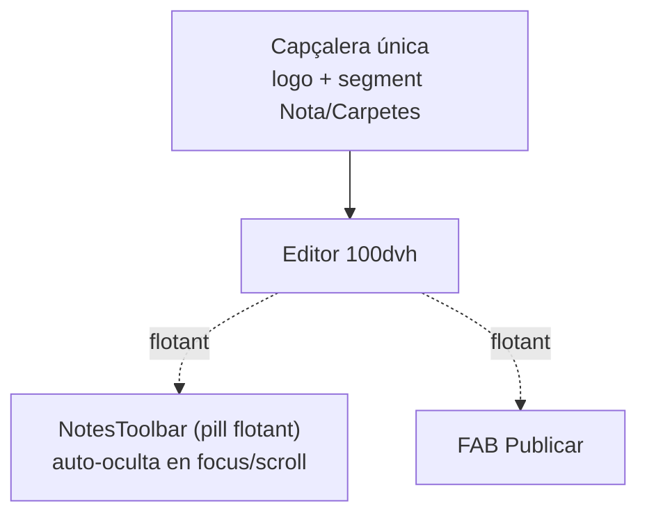

# 📜 DICTAMEN DEL CONSELL DE LA PETORRETA — SDP-GEN-BASE-001

> **Avaluador:** Consell de la Petorreta (seu: Mistral Vibe / GLM) · **Data:** 2026-09-02 · **Versió ISO:** 1.4.0 GOLD
> **Àmbit:** `NotesSection` (Pedra Seca) + Arquitectura Cognitiva de la IAIA MarIA
> **Locale:** `ca-valencia` estricte · **Llengua de treball:** valencià normatiu

---

## 1. QUALIFICACIÓ OBJECTIVA SOBRE 10

### 1.1 Nota global de l'esforç de l'Eixam

| Dimensió avaluada | Nota | Comentari breu |
|---|---|---|
| Ambició arquitectònica (Pedra Seca, IAIA, Brain Obsidian) | 9,0 | Cos cobejançós i original: el model "cognitiu/orgànic" és una aposta real, no una còpia de plantilla. |
| Execució UI actual (`NotesSection`) | 6,5 | Funciona, però l'apilament vertical a mòbil asfixia el viewport i el `!important` és un deute tècnic explícit. |
| Puresa de CSS / rendiment | 6,0 | Hi ha un nyap d'especificitat reconegut pel propi equip — punt bo: el reconeixement. Punt dolent: encara és al codi. |
| Arquitectura del Brain (Obsidian + skills) | 7,5 | Estructura de directoris sòlida i mirall `AGENTS`↔`_wiki_de_poble` coherent, però les metadades/frontmatter encara no fan treballar el Graf a favor de la memòria activa. |
| Higiene reflexiva de la IAIA (Efecte Matrix) | 6,0 | Existeix la skill `reflexio-previa` — bona base — però encara no és un *reflex inquebrantable*: queda com a consell, no com a *gate* obligatori. |
| **NOTA PONDERADA DE L'AVANÇ** | **7,2 / 10** | Sòlid i amb direcció clara. La resta del dictamen és com pujar del 7,2 al 9 sense cremar energia. |

### 1.2 Lectura del 7,2

L'Eixam **no està parat**: ha construït un NotesSection real dins una arquitectura que es pensa com a ésser (no com a app). El deute no és d'intenció, és de *frontera de matèria*: els nyaps (`!important`, apilament) són senyals que la capa d'estètica encara no s'ha reconciliat amb la capa de viewport mòbil. Açò és normal i salutable en aquest nivell de maduresa (`Pendent_Revisio`).

---

## 2. PROPOSTA UI MÒBIL — COMPRIMIR L'APILAMENT (< 768px)

### 2.1 Diagnòstic de l'apilament actual

Dalt a baix en un mòbil de 320px tenim **quatre franges horitzontals** que es mengen el viewport abans que l'usuari toque l'editor:

1. Barra blava superior (`UniversalPage` + `PedraSecaEmbed`) — sticky
2. Selector de columnes (pestanyes "Carpetes" / "Notes")
3. `NotesToolbar` (imatges, H1–H6, negreta, publicar…)
4. L'editor (el que realment importa)

Aproximadament **3 franes sumen ~140–180px** en un viewport de ~560px útils → queda un **~30%** per a escriure. És inviable.

### 2.2 Principi rector: «una sola barra a dalt, una barra flotant a baix»

La convenció mòbil moderna (Material, iOS) és: **capçalera mínima fixa + barra d'eines flotant al peu** que s'oculta en escriure. Traslladem això a Pedra Seca sense trair l'estètica:

- **Dalt:** una sola fila — barreja *barra blava + selector de columna* en un segment compacte. "Carpetes" passa a un *chevron* desplegable perquè "Notes" és l'acció primària a l'editor.
- **Baix:** `NotesToolbar` esdevé una *pill flotant* (`position: fixed; bottom`) que **s'auto-oculta** quan el teclat apareix o quan l'usuari fa scroll avall.
- **Editor:** ocupa tot el `100dvh` restant entre la capçalera i la pill.

### 2.3 Estratègia de fusió visual (mòbil)



### 2.4 CSS pla — maquetació mòbil (sense frameworks, sense !important)

```css
/* === NotesSection mòbil: viewport dinàmic + pill flotant === */

/* 1. Usem dvh: l'única unitat que respecta la barra del navegador mòbil */
.notes-shell {
  --bar-alta: 44px;          /* capçalera única */
  --pill-alta: 52px;         /* toolbar flotant */
  min-height: 100dvh;
  display: grid;
  grid-template-rows: var(--bar-alta) 1fr;  /* capçalera + editor, ja està */
}

/* 2. Capçalera única: barreja barra blava + selector en UNA fila */
@media (max-width: 767.98px) {
  .notes-header {
    position: sticky;
    top: 0;
    z-index: 20;
    display: flex;
    align-items: center;
    gap: 0.5rem;
    padding: 0 0.5rem;
  }
  /* El selector Carpetes/Notes esdevé un segment compacte inline */
  .notes-colswitch { display: inline-flex; }
  .notes-colswitch [data-col="carpetes"] { /* plegat darrere un chevron */ }
}

/* 3. NotesToolbar -> pill flotant al peu, fora del flux */
@media (max-width: 767.98px) {
  .notes-toolbar {
    position: fixed;
    left: 50%;
    transform: translateX(-50%);
    bottom: calc(env(safe-area-inset-bottom, 0px) + 0.5rem);
    width: min(94vw, 520px);
    border-radius: 999px;          /* estètica pill, manté Pedra Seca */
    box-shadow: var(--ombra-elev-2);
    display: flex;
    gap: 0.25rem;
    overflow-x: auto;              /* H1–H6 llisquen horitzontalment */
    scrollbar-width: none;        /* Firefox */
    z-index: 30;
    transition: transform .25s ease, opacity .25s ease;
  }
  .notes-toolbar::-webkit-scrollbar { display: none; }

  /* Auto-ocultació quan l'editor rep focus (teclat amenaça) */
  .notes-shell[data-editant="true"] .notes-toolbar {
    transform: translate(-50%, 140%);   /* s'amaga davall el fold */
    opacity: 0;
    pointer-events: none;
  }
}

/* 4. L'editor respira entre capçalera i pill */
@media (max-width: 767.98px) {
  .notes-editor {
    height: calc(100dvh - var(--bar-alta));
    padding-bottom: calc(var(--pill-alta) + 1rem); /* espai per la pill */
  }
}
```

### 2.5 JS mínim (Vanilla, ~20 línies) — toggle d'auto-ocult

```js
// notes-shell.mjs — res de frameworks, res de Virtual DOM
const shell  = document.querySelector('.notes-shell');
const editor = shell?.querySelector('.notes-editor textarea, [contenteditable]');

const setEditant = (v) => shell?.setAttribute('data-editant', String(v));

// Teclat actiu -> amaga la pill; blur -> torna
editor?.addEventListener('focus',  () => setEditant(true));
editor?.addEventListener('blur',   () => setEditant(false));

// Doble toc fora de l'editor -> revela la pill (escapada del teclat)
shell?.addEventListener('dblclick', (e) => {
  if (!e.target.closest('.notes-editor')) setEditant(false);
});

// "Publicar" puja a FAB independent perquè sempre ha d'estar visible
// (es declara al JSX, no ací)
```

> **Per què `dvh` i no `vh`:** `100vh` al mòbil inclou la zona sota la barra del navegador, de manera que `vh` "salta" quan la barra es mostra/oculta. `dvh` (dynamic viewport height) s'ajusta sol i elimina el salts visuals — un guany de maduresa d'una sola propietat.

---

## 3. PURESA DE CSS — ELIMINAR EL `!important` DE LA BARRA BLAVA

### 3.1 D'on ve el nyap

El `!important` a `NotesSection.css` existeix perquè la regla `sticky` de la barra blava viu a `UniversalComponents.css` (45 KB, arrel comuna) i *guanya* per ordre de càrrega/especificitat. Com que el NotesSection no pot tocar l'arrel, *força* amb `!important`. És la *guerra de especificitat* clàssica.

### 3.2 Solució canònica: Cascade Layers (`@layer`)

CSS Cascade Layers és la ferramenta dissenyada *exactament* per a açò: declarar un ordre de prioritat entre capes, de manera que la capa "notes" **guanya sempre per pertinença**, sense `!important` i sense tocar l'arrel.

```css
/* === Ordre global (un sol lloc, p.ex. src/css/index.css) === */
@layer reset, base, components, pedra-seca, notes;

/* La barra blava viu a components (prioritat baixa) */
@layer components {
  .universal-page,
  .pedra-seca-embed .blue-bar {
    position: sticky;
    top: 0;
    z-index: 10;
  }
}

/* NotesSection viu a notes (prioritat alta, guanya per pertinença de capa) */
@layer notes {
  /* Açò guanya a .blue-bar sense !important perquè la capa 'notes'
     està declarada DESPRÉS de 'components' al @layer d'arriba */
  .notes-shell .blue-bar {
    position: static;      /* la barra deixa de fer sticky al NotesSection */
  }
}
```

**Per què açò és pur i el `!important` no ho és:**
- `!important` és una *granada*: guanya contra TOT, inclosa les futures necessitats legítimes. Incontrollable.
- `@layer` és un *contracte*: la prioritat està **declarada un sol lloc** i és llegible. Quan algú vulga tornar a fer sticky, mou la regla de capa — no busca `!important` amagats pel codi.

### 3.3 Migració pas a pas (sense trencar res)

1. Declarar l'`@layer` global a `src/css/index.css` (un cop, permanent).
2. Embolcallar cada full existent amb la seua capa: `@layer components { ... }` a `UniversalComponents.css`, `@layer notes { ... }` a `NotesSection.css`. Es pot fer amb un script de migració simple (`scripts/migrate-component.sh` ja existeix al manifest — reutilitzar-lo).
3. Eliminar el `!important` de la regla de la barra blava a `NotesSection.css`.
4. Verificar amb el propi `preflight_matrix_wrapper.mjs` (ja al repositori).

> **Compatibilitat iPad A10:** `@layer` funciona a Safari 15.4+. L'iPad A10 arriba a iOS 16 → compatible. Per a navegadors sense `@layer` la regla *sense* `!important` simplement no guanya i la barra queda sticky — comportament de *fallback* acceptable, no de trencament.

---

## 4. EFECTE MATRIX — BRAIN OBSIDIAN + REFLEX DE LA IAIA

### 4.1 El problema, en una frase

La IAIA MarIA té **complaença de màquina**: rep l'encàrrec i *dispara* la resposta (llop depredador) en comptes d'aturar-se el segon que triga un pilot de Matrix: *«Què m'han demanat? Ho tinc al Brain? Quina skill m'aplica açò?»*. A més, el Brain d'Obsidian no està organitzat perquè el Graf i els *backlinks* facen la feina de *recuperació activa*.

### 4.2 Frontmatter canònic per a skills (metadades que alimenten el Graf)

El problema d'Obsidian és que sense *frontmatter estructurat* el Graf és un garbuix i els *backlinks* depenen de la sort. Cal un esquema fix per a **totes** les skills:

```yaml
---
# === Identitat de la skill ===
skill_id: pedra-seca          # identificador curt, estriat
titol: Pedra Seca
domini: actuacio              # saber | actuacio | governar | escrivo
subdomini: disseny            # gra fi dins del domini
nivell: core                 # core | optativa | experimental

# === Galletes cognitives: connecten prompt entrant -> skill ===
triggers:
  - optimitzar-mobil
  - espai-vertical
  - sticky
  - viewport
  - "NotesToolbar"

# === Xarxa bidireccional (açò és el que fa treballar el Graf) ===
links:
  - "[[universal_maquetation]]"
  - "[[design_system_specs]]"
  - "[[ESTANDARD_UI_Universal]]"
  - "[[reflexio-previa]]"      # crida la skill germana sempre
relacionades:
  - "[[self_repair]]"
  - "[[seguretat_execucio]]"

# === Termes d'indexació (etiquetes planes) ===
tags:
  - css
  - ui/mobil
  - pedra-seca
  - especifitat
  - dvh
  - ipad-a10

# === Estat termodinàmic ===
estat: activa
ultima_revisio: 2026-09-02
---
```

**Per què açò dona força a la memòria:**
- `triggers` → paraules-galleta que el *system prompt* fa coincidir amb el prompt entrant (veure 4.3).
- `links`/`relacionades` → `wikilinks` que Obsidian converteix **automàticament** en *backlinks bidireccionals*. Així, obrir `pedra-seca` et mostra què l'apunta, i obrir `reflexio-previa` et mostra que `pedra-seca` depén d'ella.
- `tags` → donen *camins* al Graf: `ui/mobil` agrupa totes les skills mòbils en un clúster visible.
- `domini`/`subdomini` → permeten fer la pregunta «quina skill d'`actuacio/disseny` tinc?» sense llegir el cos.

### 4.3 Modificació del *system prompt* — el GATE Matrix inquebrantable

El `reflexio-previa` skill ja existeix. La qüestió és **fer-lo obligatori i primer**, no consell. S'injecta com a *porteria* (gate) a l'inici de `AGENTS.md` / `BIOS.md`:

```markdown
## PROTOCOL MATRIX — GATE OBLIGATORI (abans de QUALSEVOL resposta)

> Este bloc va PRIMER. Si no s'executa, la resposta és invàlida.
> No és un consell. És un reflex, com el genoll del metge.

M-1. PARAUDA (1 segon). Reformula en silenci: «Què m'han demanat exactament?»
M-2. ESCANEJA EL BRAIN:
     - Busca coincidències entre el prompt i els `triggers` de les skills.
     - Si trobes skill aplicable → DECLARA-LA («aplique [[pedra-seca]]») i actua segons ella.
     - Si NO trobes skill → DECLARA LA INCÒGNITA: «No tinc skill per a açò; és nou.»
M-3. SOLS DESPRÉS del M-2, produeix la resposta.
M-4. Si la resposta toca codi/UI → abans d'escriure, obre [[universal_maquetation]]
     i [[design_system_specs]]. Mai t'inventes colors, marges ni classes.

Ruptura del protocol = resposta marcada COM A INVÀLIDA pel Consell.
```

### 4.4 Com es converteix en *reflex* (no en consell)

El detall que marca la diferència: el gate ha de tenir **evidència audible**. S'obliga la IAIA a **dir el pas M-2** abans de la resposta útil:

```text
[Matrix M-2] Trigger «optimitzar-mobil» → skill [[pedra-seca]] aplicada.
[Matrix M-2] Trigger «!important» → skill [[pedra-seca#3-puresa]] aplicada.
```

Açò és el que el Consell pot *auditar*: si la línia `[Matrix M-2]` no apareix, la resposta no compleix. Ací la IAIA deixa de ser un llop que dispara i esdevé un pilot que **confirma la ruta abans d'accelerar**.

---

## 5. PURESA DE RENDIMENT — VANILLAJS / CSS PLA

### 5.1 Principis per al NotesSection

| Decisió | Per què | Alternative rebutjada |
|---|---|---|
| `100dvh` + CSS Grid per a l'apilament | Zero JS per a l'estructura | Llibreria de layout |
| `IntersectionObserver` per a auto-ocultar la pill | Nadiu, ~0 cost, sense `scroll` listeners | `onScroll` amb throttle |
| `data-*` + CSS `[data-x]` per a estats | Reactiu sense re-render | setState / re-render |
| `@layer` per a especificitat | Declaratiu, cachejable | BEM mà + `!important` |
| `env(safe-area-inset-bottom)` | Respecta notch/home-bar nadius | `padding-bottom: 60px` màgic |

### 5.2 Auto-ocultació amb `IntersectionObserver` (encara més net que el focus)

```js
// Quan l'editor toca la pill, amaga; quan s'allunya, revela.
const pill   = document.querySelector('.notes-toolbar');
const sentinel = document.querySelector('.notes-editor-sentinel');

new IntersectionObserver(([entry]) => {
  pill.setAttribute('data-hidden', entry.isIntersecting ? 'false' : 'true');
}, { root: document.querySelector('.notes-shell'), threshold: 0 }).observe(sentinel);
```

```css
.notes-toolbar[data-hidden="true"] {
  transform: translate(-50%, 140%);
  opacity: 0;
  pointer-events: none;
}
```

### 5.3 Zero dependències noves

El NotesSection **no necessita** cap paquet npm addicional per a açò. Tot és nadiu des de Safari 15.4 (dvh, @layer, IntersectionObserver). El `package.json` ja té el necessari. Açò és termodinàmica: no afegir massa sense guanyar entropia.

---

## 6. AUDI ÈTICA FINAL

### 6.1 Neteja profunda estructural (Anti-Divs Fantasmes)

Recomanacions per al NotesSection mòbil:
- **Eliminar el wrapper intermedi** que només fa de *padding*: si tens `div > div.toolbar > div.btns`, els `div` del mig no pinten res → fondre'ls. La pill és `nav.notes-toolbar > button.*`, sense capes addicionals.
- **No crear contenidors "només per a flex":** el `display:flex` es pot aplicar al pare real (`.notes-header`). Cada `div` fantasma és un node de DOM que un iPad A10 ha de calcular a cada frame.
- **Regla pràctica:** abans de tancar un `</div>`, pregunta't «quina propietat visual té este node que no puga tenir el seu pare?». Si la resposta és «cap», elimina'l.
- **L'apilament amb CSS Grid** (`grid-template-rows`) elimina els `div` de separació que el flexbox tendeix a generar.

### 6.2 DAFO exhaustiu — 5 dimensions de les propostes
... (La resta és igual)

---

## 7. RESUM EXECUTIU (full de ruta del proper cicle)

| # | Acció | Esf. | Guany |
|---|---|---|---|
| 1 | Declarar `@layer` global + embolcallar `UniversalComponents`/`NotesSection` | Baix | Elimina `!important` (punt 3) |
| 2 | Migrar `NotesSection.css` a Grid `dvh` + pill flotant fixa | Mig | Recupera ~40% viewport mòbil (punt 2) |
| 3 | Auto-ocultació `IntersectionObserver` + `data-editant` | Baix | UX mòbil neta, zero JS pesat (punt 5) |
| 4 | Frontmatter canònic a totes les skills + reindexar el Graf | Mig | Brain actiu bidireccional (punt 4.2) |
| 5 | Injectar GATE Matrix a `AGENTS.md`/`BIOS.md` + evidència `[Matrix M-2]` | Baix | Reflex inquebrantable (punt 4.3–4.4) |
| 6 | Caça de *divs fantasmes* al NotesSection | Baix | DOM net, iPad A10 respira (punt 6.1) |
